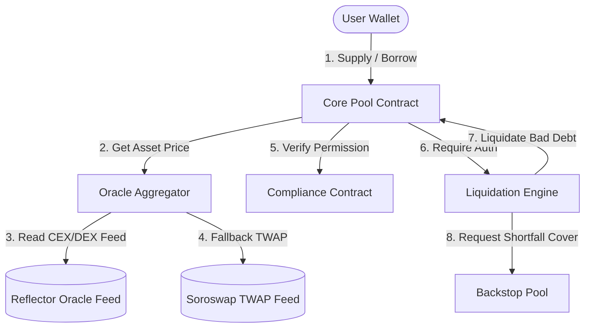
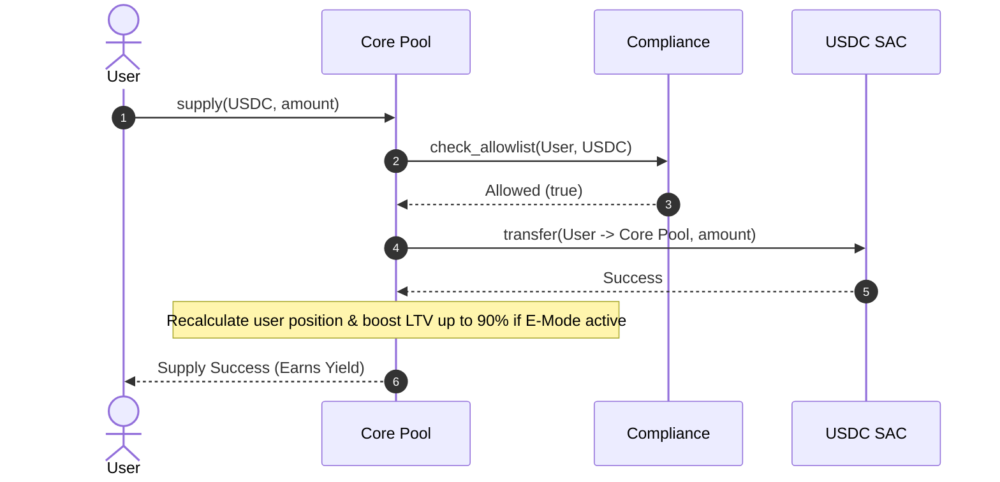
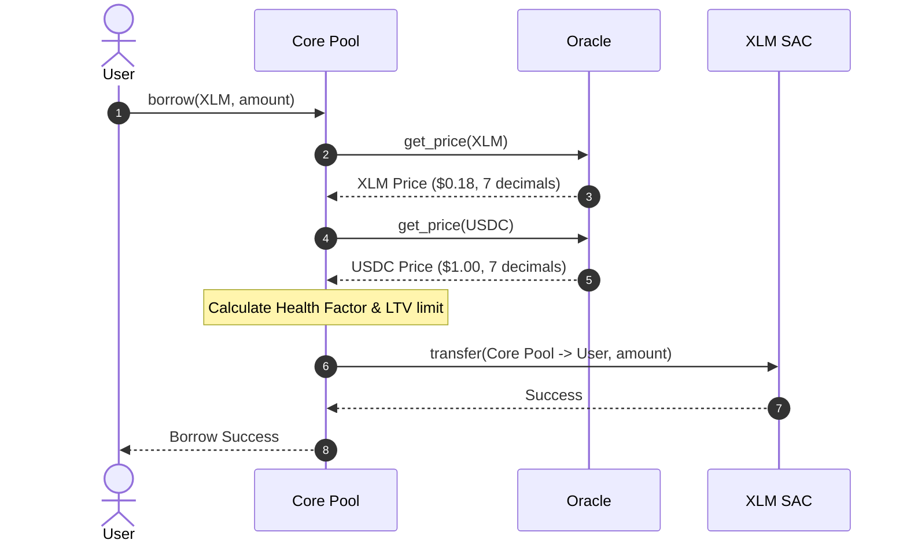
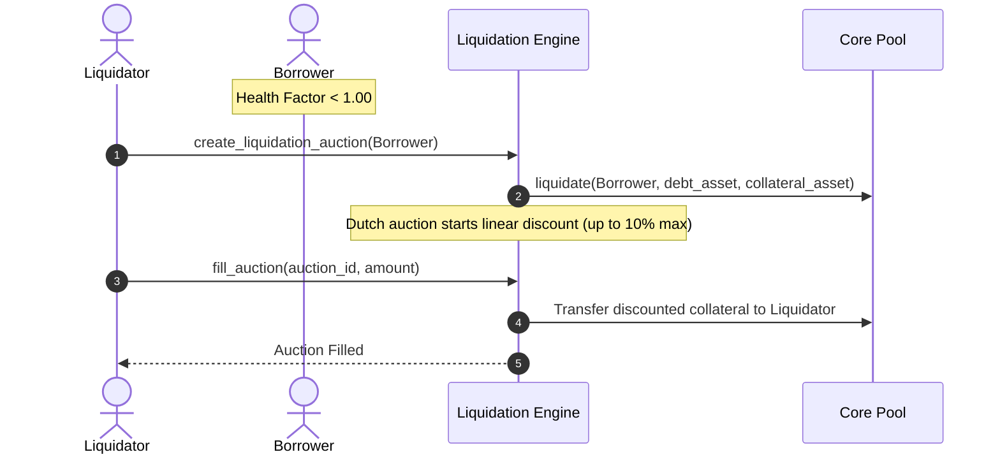
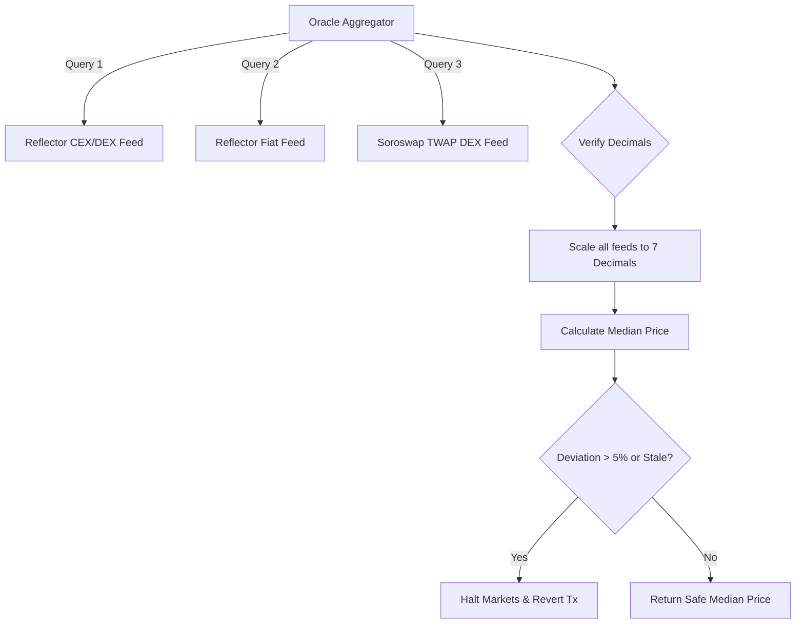

# 🪐 Ergo Protocol

> **Lend Smarter. Borrow Safer. The Premier Non-Custodial Liquidity Layer on Stellar.**

Ergo Protocol is a next-generation, non-custodial decentralized lending and borrowing platform built natively on the **Stellar/Soroban** smart contract network. It leverages a high-performance **Shared Core** pool coupled with isolated **Satellite Pools** to provide maximum capital efficiency, real-time risk isolation, and institutional-grade compliance gates.

## Demo -
https://youtu.be/7Yuw5vHb_Wk
---

## Socials:
https://x.com/ergoprotocol


---
## 🏛️ Mainnet Contract Registry

Below are the official deployed contract addresses for Ergo Protocol on the **Stellar Mainnet** (`public`):

| Contract | Mainnet Address | Deployment Wallet |
| :--- | :--- | :--- |
| **Core Pool** | `CCGIBZCTJQV5ENURT6YKGZ34VVGELBR2O2NUCZED2DDMV4T7FWMJMFKK` | `GCK5L4DAV6...3JHE` |
| **Oracle Aggregator** | `CCZIMNOOYPBJBVAXOOIPSI2SJNR6R3LBEEZNDIEI2H2YVTYASAVI772H` | `GCK5L4DAV6...3JHE` |
| **Liquidation Engine** | `CBGWB7FCL5OMOUKSCXBZQ5FVFSHX3RDVD53QHZ6JRYRXQVHSLGIAPVHJ` | `GCK5L4DAV6...3JHE` |
| **Compliance** | `CBL5WKK2WQ4XGGN25DW3OP2LIGI5GUDLBXNQ76ZLFQLU3RRBBAPGQTLU` | `GCK5L4DAV6...3JHE` |
| **Ergo Token (ERGO)** | `CDILV5HTHZGWQYRL6TJP3MUTSCRXXQSAUHBMASXPZVC2BS4I3QUE5IDQ` | `GCK5L4DAV6...3JHE` |
| **Backstop Pool (Fallback)** | `CBHFJXAP7EZUGCK4NNVT57JMW3KHBHXYFEAPCIT7UBHIAZJ2S5O24LEY` | `GCK5L4DAV6...3JHE` |
| **Governance (Fallback)** | `CBL5WKK2WQ4XGGN25DW3OP2LIGI5GUDLBXNQ76ZLFQLU3RRBBAPGQTLU` | `GCK5L4DAV6...3JHE` |

---
## Active users with their detailed Feedback: 
https://docs.google.com/spreadsheets/d/1vLztvp1yzuMoxyTsJxFebRteebIhMIdvP6aaxCJ9CrQ/edit?usp=drivesdk

---

## 🛠️ Key Features & Core Workflows

### 1. Overall System Architecture
Ergo integrates multiple layers (Oracle Aggregator, Compliance Gates, Liquidation Dutch Auctions) under a single unified liquidity core.



---

### 2. Supply & Dynamic E-Mode (Efficiency Mode)
Users supply assets (USDC, EURC, XLM) to earn interest. Correlated stablecoin asset pairs (e.g. USDC/EURC) automatically trigger E-Mode, allowing up to **90% LTV** borrowing power.



---

### 3. Non-Custodial Borrowing
Borrowers draw liquidity from the pool against their supplied collateral, verified in real-time by the dual-oracle pricing layer.



---

### 4. Dutch Liquidation Auction
When a borrower's Health Factor drops below `1.00`, the Liquidation Engine creates a Dutch curve auction to allow liquidators to repay debt and claim collateral at a linear discount.



---

### 5. Oracle Price Feeds & Circuit Breaker
The Oracle Aggregator queries primary and fallback price layers, standardizes the decimals, and executes a real-time circuit breaker if feed deviation exceeds 5% or if price data goes stale.



---

## 🚀 How to Use Ergo Protocol

### 1. Supplying Collateral
1. Connect your Stellar wallet (Freighter, Albedo, etc.) on the [Ergo Dashboard](https://ergo-protocol-1.vercel.app/dashboard).
2. Choose your market (e.g. `USDC Shared Pool`) and click **Supply**.
3. Input the amount. The dashboard will simulate your transaction impact (gas fee, LTV boost, health factor increase).
4. Click **Submit** and sign the transaction in your wallet.

### 2. Borrowing Assets
1. Once you have active collateral, select the asset you wish to borrow (e.g. `XLM`).
2. Input the borrow amount. Ensure your predicted **Health Factor** remains safely above `1.15` to avoid liquidation risk.
3. Approve and sign the transaction.

### 3. Liquidation Fills
* Anyone can run the liquidation engine to close unhealthy positions.
* Query the active auctions via `/api/auctions` or directly interact with the `Liquidation Engine` contract to fill an auction and purchase discounted collateral.

---

## 💻 Developer Setup & Build Commands

### Prerequisites
* **Rust**: stable rust compiler with target `wasm32-unknown-unknown`
* **Node.js**: v20+ with `pnpm`
* **Stellar SDK**: `@stellar/stellar-sdk` v16.0.1 (pre-configured)

### Compilation & Build Checks
Execute workspace-wide build checks to ensure complete system integration:

```bash
# 1. Compile and optimize WASM smart contracts
cargo build --target wasm32-unknown-unknown --release
python scripts/optimize_wasm.py

# 2. Build the Backend API Server
pnpm --dir server run build

# 3. Build the Next.js Frontend Client
pnpm --dir client run build
```

---

## 🛡️ License
Apache-2.0
