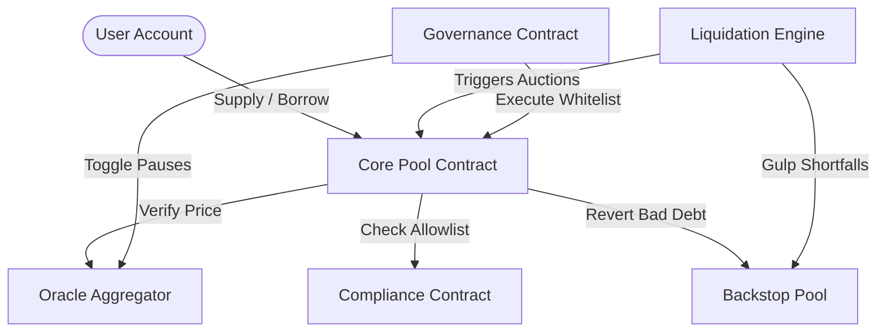

# Ergo Protocol

> Lend Smarter. Borrow Safer. Built for What Stellar Becomes Next.

Non-custodial, over-collateralized lending protocol on Stellar/Soroban.
Live at https://ergo-protocol.vercel.app

## What is Ergo?
Ergo is a next-generation decentralized liquidity protocol developed specifically for the Stellar network. Combining a high-performance **Shared Core** pool design with isolated **Satellite Pools**, Ergo manages capital allocations dynamically. Highly correlated asset pairs leverage E-Mode boosts to attain up to 90% LTV, while a multi-feed decentralized Oracle Aggregator isolates market risk via real-time circuit breakers.

To ensure compliance with institutional lending standards, real-world asset (RWA) issuers can register permissioned pools gated by issuer allowlists. The protocol utilizes a Dutch curve liquidation auction backed by a dedicated Backstop Pool structure to cover bad debt and prevent protocol insolvency.

## Architecture Overview



| Contract | Purpose |
|---|---|
| [Core Pool](file:///c:/Users/SAYAN/Ergo-Protocol-1/contracts/core-pool/) | Supply, borrow, repay, withdraw, flash loans, user health factor calculations |
| [Oracle Aggregator](file:///c:/Users/SAYAN/Ergo-Protocol-1/contracts/oracle-aggregator/) | Multi-feed median price calculations, feed staleness filters, circuit breakers |
| [Backstop](file:///c:/Users/SAYAN/Ergo-Protocol-1/contracts/backstop/) | Per-pool insurance funds, worst-case shortfall coverage, withdrawal queues |
| [Liquidation Engine](file:///c:/Users/SAYAN/Ergo-Protocol-1/contracts/liquidation-engine/) | Dutch curve auction execution, flash fill triggers, protocol fallbacks |
| [Governance](file:///c:/Users/SAYAN/Ergo-Protocol-1/contracts/governance/) | Timelocked proposals, quorum verification, whitelisted cross-contract executors |
| [Compliance](file:///c:/Users/SAYAN/Ergo-Protocol-1/contracts/compliance/) | Institutional allowlists, native auth flag verification, issuer RWA clawback |

## Deployed Contract Addresses (Stellar Testnet)

| Contract | Testnet Address | Mainnet |
|---|---|---|
| Core Pool | `CD7W2...POOL` | TBD |
| Oracle Aggregator | `CBKF3...ORAC` | TBD |
| Backstop | `CCBS4...BACK` | TBD |
| Liquidation Engine | `CDLE5...LIQD` | TBD |
| Governance | `CGVN6...GOVR` | TBD |
| Compliance | `CCMP7...COMP` | TBD |

## Getting Started

### Prerequisites
- Rust + `soroban-sdk` 21.0.0
- Stellar CLI
- Node.js 20+
- PostgreSQL 15+
- Redis 7+

### Clone and Setup
1. Clone the repository and install dependencies:
   ```bash
   git clone https://github.com/mesayanroy/Ergo-Protocol.git
   cd Ergo-Protocol
   pnpm install
   ```

2. Initialize database:
   ```bash
   psql -U postgres -d ergo_protocol -f server/src/db/schema.sql
   ```

3. Configure environment files in `server/.env` based on `server/.env.example`.

### Run Tests
Execute the Rust unit tests across all contracts:
```bash
cd contracts/core-pool && cargo test
cd ../oracle-aggregator && cargo test
cd ../backstop && cargo test
cd ../compliance && cargo test
cd ../liquidation-engine && cargo test
cd ../governance && cargo test
```

### Deploy to Testnet
Run the deploy scripts using Stellar CLI commands:
```bash
pnpm --dir scripts run deploy-testnet
```

---

## Key Parameters

| Parameter | Value | Description |
|---|---|---|
| `MAX_STALENESS_LEDGERS` | 200 | Oracle price rejected if older than ~16 minutes |
| `MAX_DEVIATION_BPS` | 500 | Circuit breaker threshold (5% feed deviation) |
| `HF_LIQUIDATION_THRESHOLD` | 1.00 | Health factor threshold for auction triggers |
| `AUCTION_WINDOW_LEDGERS` | 200 | Dutch curve linear discount duration |
| `MAX_DISCOUNT_BPS` | 1000 | Maximum discount applied to collateral reward (10%) |
| `MIN_FEED_QUORUM` | 2 | Minimum active oracle feeds required |
| `XLM_COLLATERAL_FACTOR` | 75% | Standard XLM loan-to-value limit |
| `USDC_COLLATERAL_FACTOR` | 85% | Standard USDC loan-to-value limit |
| `EMODE_LTV` | 90% | Correlated E-Mode asset pair LTV limit |
| `GOVERNANCE_QUORUM` | 15% | Minimum participation requirement for proposals |
| `GOVERNANCE_THRESHOLD` | 66% | Votes in favor required to approve a proposal |

---

## How It Beats Blend Capital

| Feature | Ergo Protocol | Blend Capital |
|---|---|---|
| **Capital Efficiency** | Up to **90% LTV** via E-Mode correlated assets | Standard risk curves only |
| **Oracle Resilience** | Median of N Feeds with real-time **Circuit Breaker** halts | Single oracle feeds |
| **Liquidation Reliability** | **Dutch Auctions** + atomic **Flash Fills** | Standard fixed-discount liquidations |
| **Compliance & RWA** | Stellar Native Allowlists and **Issuer Clawbacks** | No native compliance registry |
| **Unified Liquidity** | Multi-pool shared cores with **Backstop Isolation** | Isolated pool fragmentation |

## Security
For audit reports, bug bounty submissions, or SCF Audit Bank acknowledgments, contact our security team at security@ergo-protocol.com.

## License
Apache-2.0