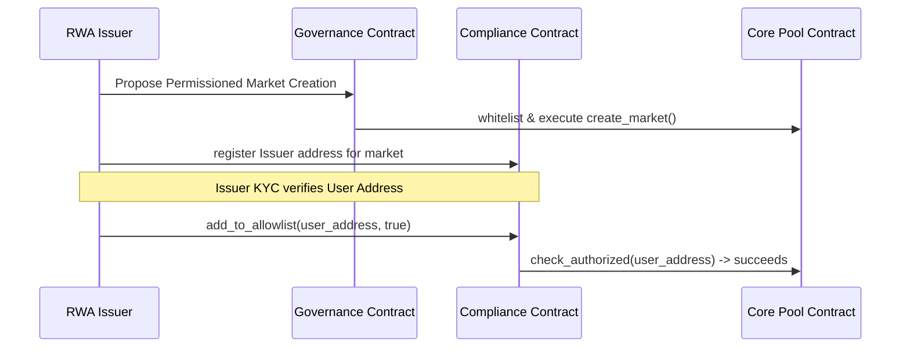

# Compliance & RWA Gating

Ergo Protocol provides built-in compliance wrappers designed to bridge decentralized finance with institutional requirements, payroll lending pools, and Real-World Asset (RWA) tokenization.

---

## 1. Stellar Native Authorization Flags

Stellar's native asset ledger implements robust issuer control flags. The Compliance contract bridges these flags directly to loan pool operations:

1. **`AUTH_REQUIRED_FLAG`**:
   - When set, any address must be explicitly authorized by the asset's issuer before it can receive or hold the asset.
   - For permissioned markets in Ergo, the Core Pool checks the compliance contract's allowlist on `supply()` or `borrow()` operations, rejecting requests if the user's KYC allowlist check fails.
   
2. **`AUTH_REVOCABLE_FLAG`** & **`AUTH_CLAWBACK_ENABLED_FLAG`**:
   - Enables issuers to claw back token balances from accounts under specific regulatory freeze conditions.
   - The compliance contract checks that clawback is natively enabled on the asset before executing.
   - If a regulatory clawback is triggered via `clawback_position(issuer, market_id, user, amount)`, the Compliance contract uses Stellar's native clawback operation to withdraw the user's supplied position and return it to the issuer, updating Core Pool balances atomically.

---

## 2. Institutional RWA Onboarding Flow

To create and manage a permissioned Real-World Asset market:

1. **Issuer Registry**: The issuer registers their authority over the market.
2. **User Allowlisting**: Users undergo institutional KYC verification. Once verified, the issuer invokes `add_to_allowlist(market_id, user_address, true)`.
3. **Execution**: The user can now supply or borrow from the permissioned market.

---

## 3. Use Case: Corporate Payroll advances

A company can set up a permissioned Lending Pool specifically for employees:
- **Collateral**: Mock salary/shares tokens.
- **Allowed Users**: Employees added to the allowlist by the employer's wallet (acting as Issuer).
- **Control**: The pool enforces a `debt_ceiling` (e.g. $500,000) to limit aggregate corporate exposure.
- **Settlement**: Salary advancements are borrowed against the collateral, and the employer can trigger automated repayments during payroll runs.

---

## 4. Use Case: Institutional Credit Delegation

Credit delegation enables institutions to monetize collateral without direct transfer:
1. **Delegator**: Deposits collateral (e.g. tokenized cash/bonds) in the shared core pool.
2. **Delegation**: Calls `delegate_credit(delegator, delegatee, market_id, limit)` to allocate borrowing power to a whitelisted counterparty.
3. **Borrowing**: The delegatee borrows against the delegator's collateral up to the limit. The transaction verifies health factor bounds against the delegator's position, ensuring credit risk is ring-fenced.
