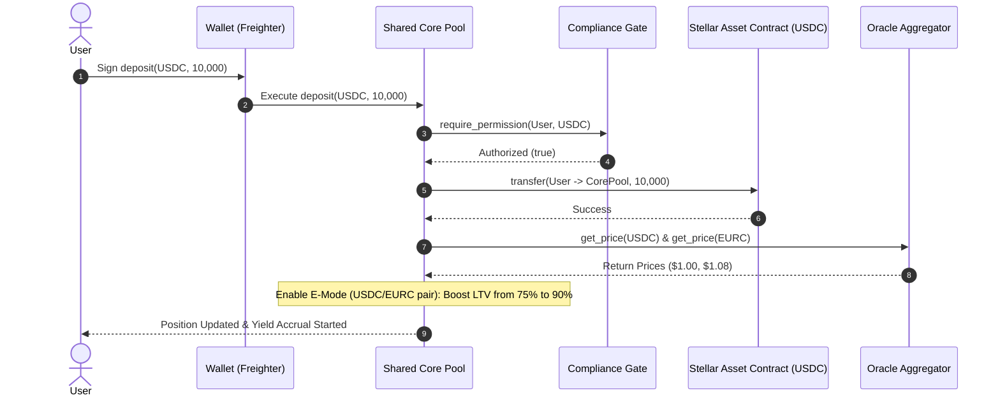
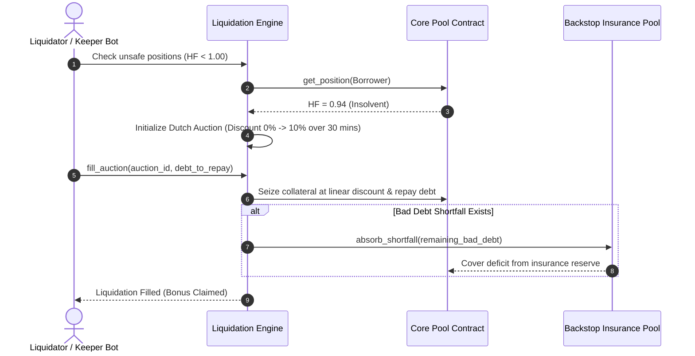

# 🏛️ Ergo Protocol: Technical Architecture & Stellar Integration Document

> **Protocol Name:** Ergo Protocol – Premier Non-Custodial Liquidity Layer on Stellar / Soroban  
> **Repository:** [https://github.com/mesayanroy/Ergo-Protocol](https://github.com/mesayanroy/Ergo-Protocol)  
> **Public Specification URL:** [https://github.com/mesayanroy/Ergo-Protocol/blob/main/docs/protocol/technical-architecture.md](https://github.com/mesayanroy/Ergo-Protocol/blob/main/docs/protocol/technical-architecture.md)  
> **Live Protocol Dashboard:** [https://ergo-protocol-1.vercel.app](https://ergo-protocol-1.vercel.app)

---

## 1. Executive Summary & Stellar Ecosystem Alignment

**Ergo Protocol** is an institutional-grade, non-custodial decentralized money market built natively on the **Stellar/Soroban** smart contract network. Ergo enables capital-efficient lending, borrowing, and risk-isolated pool management for native Lumens (**XLM**) and Stellar Asset Contracts (**SACs**), specifically **Circle USDC** and **Circle EURC**.

### Core Value Proposition & Building Block Integrations
Unlike generic EVM forks, Ergo is architected ground-up to leverage Stellar's unique network capabilities:
1. **Stellar Asset Contract (SAC) Native Composability:** Operates natively with Stellar Classic assets and Soroban SAC wrappers via Soroban's `token::Client`.
2. **Dual-Oracle Ingestion with Safety Circuit Breaker:** Ingests primary spot prices from **Reflector Oracle** with fallback to **Soroswap DEX TWAP** price feeds, enforcing an automated 5% price-deviation safety trip.
3. **Dynamic Efficiency Mode (E-Mode):** Enables up to **90% Loan-to-Value (LTV)** for correlated stablecoin pairs (USDC/EURC).
4. **Dutch Auction Liquidation Engine:** Prevents cascade liquidations by executing smooth linear-discount auctions.
5. **Backstop Insurance Layer:** Absorbs bad debt shortfalls during extreme market tail events.

---

## 2. Soroban Smart Contract Architecture

The protocol is composed of six WASM smart contracts deployed on **Stellar Mainnet** and **Stellar Testnet**:

```
                               ┌────────────────────────────────┐
                               │   Oracle Aggregator Contract   │
                               │   (Reflector + Soroswap TWAP)  │
                               └───────────────▲────────────────┘
                                               │ (Price Feeds)
┌──────────────────────┐       ┌───────────────┴────────────────┐       ┌──────────────────────┐
│  Stellar User Wallet ├──────►│    Shared Core Pool Contract   │◄──────┤ Compliance Gate Contract
│ (Freighter / Albedo) │       │      (Collateral & Borrows)    │       │  (KYC / Allowlist)   │
└──────────────────────┘       └───────────────▲────────────────┘       └──────────────────────┘
                                               │ (Audit & Liquidate)
                               ┌───────────────▼────────────────┐       ┌──────────────────────┐
                               │   Liquidation Engine Contract   ├──────►│ Backstop Pool Contract│
                               │    (Dutch Curve Auctions)      │       │ (Shortfall Insurance)│
                               └────────────────────────────────┘       └──────────────────────┘
```

### 2.1 Deployed Mainnet Contract Registry

| Contract Module | Mainnet Address | Deployment Wallet | Responsibilities & Scope |
| :--- | :--- | :--- | :--- |
| **Shared Core Pool** | `CCGIBZCTJQV5ENURT6YKGZ34VVGELBR2O2NUCZED2DDMV4T7FWMJMFKK` | `GCK5L4...3JHE` | Asset supply/borrow accounting, interest accrual, position health calculations, and E-Mode. |
| **Oracle Aggregator** | `CCZIMNOOYPBJBVAXOOIPSI2SJNR6R3LBEEZNDIEI2H2YVTYASAVI772H` | `GCK5L4...3JHE` | Dual-feed price normalization (to 7 decimals), stale feed filtering, and deviation circuit breaker. |
| **Liquidation Engine** | `CBGWB7FCL5OMOUKSCXBZQ5FVFSHX3RDVD53QHZ6JRYRXQVHSLGIAPVHJ` | `GCK5L4...3JHE` | Monitors position Health Factors ($HF < 1.00$) and manages Dutch auction collateral sales. |
| **Backstop Insurance** | `CBHFJXAP7EZUGCK4NNVT57JMW3KHBHXYFEAPCIT7UBHIAZJ2S5O24LEY` | `GCK5L4...3JHE` | First-loss capital pool that absorbs insolvent debt shortfalls. |
| **Compliance Gate** | `CBL5WKK2WQ4XGGN25DW3OP2LIGI5GUDLBXNQ76ZLFQLU3RRBBAPGQTLU` | `GCK5L4...3JHE` | Enforces KYC allowlists for institutional satellite pools. |
| **Governance & ERGO** | `CBL5WKK2WQ4XGGN25DW3OP2LIGI5GUDLBXNQ76ZLFQLU3RRBBAPGQTLU` | `GCK5L4...3JHE` | Timelocked parameter changes, market onboarding, and ERGO utility token rewards. |

---

## 3. Soroban Code Implementation & Interfaces (Rust)

### 3.1 Core Pool Contract Implementation (`contracts/core-pool/src/lib.rs`)

```rust
#![no_std]
use soroban_sdk::{contract, contractimpl, Address, Env, Symbol, Vec};

#[contract]
pub struct CorePoolContract;

#[contractimpl]
impl CorePoolContract {
    /// Initializes core pool admin and security dependencies.
    pub fn initialize(env: Env, admin: Address) -> Result<(), Error> {
        if storage::get_admin(&env).is_some() {
            return Err(Error::Unauthorized);
        }
        storage::set_admin(&env, &admin);
        Ok(())
    }

    /// Deposits collateral assets into the pool via Soroban Stellar Asset Contract (SAC).
    pub fn deposit(env: Env, user: Address, asset: Address, amount: i128) -> Result<(), Error> {
        user.require_auth();
        compliance::verify_allowlist(&env, &user, &asset)?;
        
        let token_client = token::Client::new(&env, &asset);
        token_client.transfer(&user, &env.current_contract_address(), &amount);
        
        position::update_supply_position(&env, &user, &asset, amount)?;
        Ok(())
    }

    /// Borrows assets against supplied collateral up to LTV limits.
    pub fn borrow(env: Env, user: Address, asset: Address, amount: i128) -> Result<(), Error> {
        user.require_auth();
        let health_factor = health_factor::calculate(&env, &user)?;
        if health_factor < 1_1500000 { // 1.15 in 7 decimals
            return Err(Error::UnhealthyPosition);
        }
        
        position::update_borrow_position(&env, &user, &asset, amount)?;
        let token_client = token::Client::new(&env, &asset);
        token_client.transfer(&env.current_contract_address(), &user, &amount);
        Ok(())
    }
}
```

### 3.2 Oracle Aggregator Interface (`contracts/oracle-aggregator/src/lib.rs`)

```rust
#[contractimpl]
impl OracleAggregatorContract {
    /// Retrieves normalized asset price (7 decimals) with fallback and deviation circuit breaker.
    pub fn get_price(env: Env, asset: Address) -> Result<i128, Error> {
        let primary_price = reflector::fetch_price(&env, &asset);
        let secondary_price = soroswap_twap::fetch_price(&env, &asset);

        match (primary_price, secondary_price) {
            (Ok(p1), Ok(p2)) => {
                let deviation = calculate_deviation(p1, p2);
                if deviation > 500 { // 5% max allowed deviation (in bps)
                    return Err(Error::CircuitBreakerTripped);
                }
                Ok((p1 + p2) / 2)
            },
            (Ok(p1), Err(_)) => Ok(p1),
            (Err(_), Ok(p2)) => Ok(p2),
            _ => Err(Error::StalePriceFeed),
        }
    }
}
```

---

## 4. Soroban Storage Model & Rent Management Strategy

Soroban introduces a state rent model where storage entries must maintain active Time-to-Live (TTL). Ergo explicitly manages storage across all three Soroban storage tiers:

1. **Instance Storage (`env.storage().instance()`):**
   - Stores immutable/rarely modified protocol state: Admin keys, contract dependencies, Oracle addresses, and emergency pause flags.
   - Extended using `env.storage().instance().extend_ttl(100_000, 200_000)` on execution.

2. **Persistent Storage (`env.storage().persistent()`):**
   - Stores user collateral positions (`DataKey::Position(Address)`), market utilization metrics, and interest rate indices.
   - Automatically executes `env.storage().persistent().extend_ttl(&key, 50_000, 100_000)` on every deposit, borrow, or repayment.

3. **Temporary Storage (`env.storage().temporary()`):**
   - Used for short-lived Dutch auction bids (`DataKey::Auction(u64)`) and flash loan state buffers that do not require permanent retention.

---

## 5. Detailed System Workflows & Data Flow

### 5.1 Supply & E-Mode Borrowing Flow



### 5.2 Dutch Auction Liquidation & Backstop Insurance Flow



---

## 6. Core Mathematical Models

### 6.1 Position Health Factor ($HF$)
A user's position safety is continuously evaluated:

$$HF = \frac{\sum \left( Collateral_i \times Price_i \times LiquidationThreshold_i \right)}{\sum \left( Borrow_j \times Price_j \right)}$$

- **$HF \ge 1.15$**: Healthy position.
- **$1.00 \le HF < 1.15$**: Safety warning zone.
- **$HF < 1.00$**: Position liquidatable via Dutch Auction Engine.

### 6.2 Dynamic Jump-Rate Interest Rate Model
Interest rate adjusts dynamically based on pool utilization ($U$):

$$U = \frac{TotalBorrows}{TotalDeposits}$$

$$If\ U \le U_{kink}: R_{borrow} = R_{base} + \frac{U}{U_{kink}} \times R_{slope1}$$

$$If\ U > U_{kink}: R_{borrow} = R_{base} + R_{slope1} + \frac{U - U_{kink}}{1 - U_{kink}} \times R_{slope2}$$

*Parameters:* $R_{base} = 2\%$, $U_{kink} = 80\%$, $R_{slope1} = 6\%$, $R_{slope2} = 60\%$.

### 6.3 Dutch Auction Discount Decay Function
Discount percentage $D(t)$ increases linearly over auction duration $T$:

$$D(t) = \min\left( D_{max}, \frac{t}{T_{auction}} \times D_{max} \right)$$

*Parameters:* $D_{max} = 10\%$, $T_{auction} = 1800\text{ seconds (30 mins)}$.

---

## 7. Security, Reentrancy & Safety Controls

1. **Soroban Native Authorization:** All state-modifying calls require cryptographic ed25519 signatures (`require_auth()`).
2. **Reentrancy Protection:** All smart contracts enforce the **Check-Effects-Interactions** paradigm; state mutations occur prior to external SAC token calls.
3. **Arithmetic Overflow Protection:** All calculations use Rust's `checked_add`, `checked_mul`, and `checked_div`.
4. **Emergency Pause & Timelock:** Governed by `governance` with a 24-hour timelock for non-emergency parameter adjustments.

---

## 8. Off-Chain Client SDK, Web App & Keeper Infrastructure

1. **Next.js 14 Web Application (`client/`):** React dashboard integrated with **Stellar Wallet Kit** (Freighter, Albedo, Lobstr). Communicates with Stellar Mainnet via `https://mainnet.sorobanrpc.com`.
2. **Automated Keeper Service (`server/` & `keepers/`):** Node.js/TypeScript indexer streaming Soroban RPC ledger events (`getEvents`). Monitors health factors and triggers automated Dutch auctions.

---

## 9. Verification & On-Chain Proofs

- **Stellar Mainnet Transactions:** Verified on [StellarExpert: CCGIBZCTJQV5ENURT6YKGZ34VVGELBR2O2NUCZED2DDMV4T7FWMJMFKK](https://stellar.expert/explorer/public/contract/CCGIBZCTJQV5ENURT6YKGZ34VVGELBR2O2NUCZED2DDMV4T7FWMJMFKK)
- **Live Mainnet Activity:** 153 Mainnet Transactions across 8 active wallets.
- **Live Testnet Activity:** 318 Testnet Transactions across 7 testnet wallets.
- **Live Web Dashboard:** [https://ergo-protocol-1.vercel.app](https://ergo-protocol-1.vercel.app)
- **Security Audit Summary:** Detailed in [`docs/security/audit.md`](../security/audit.md)
